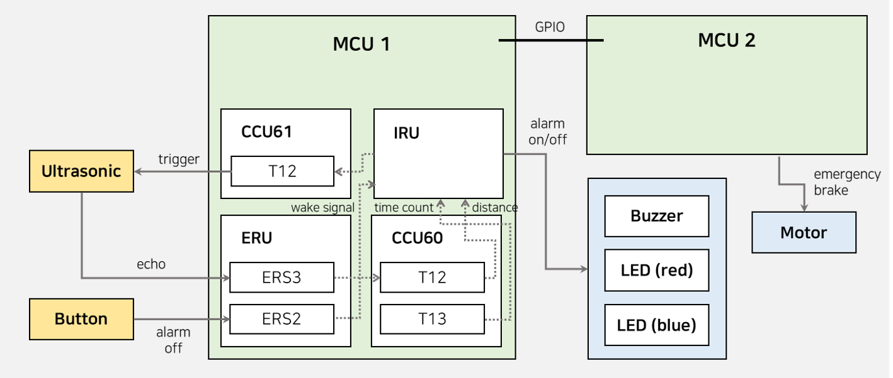
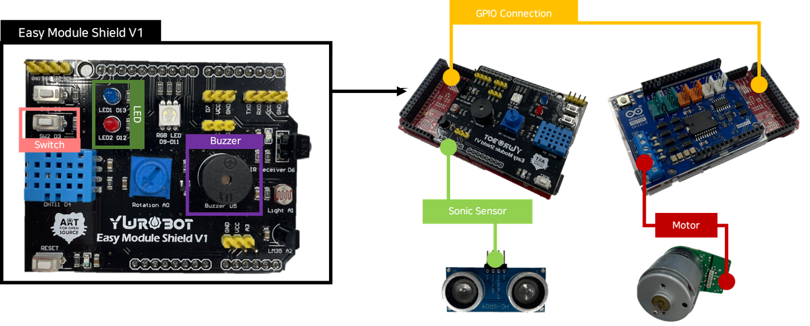
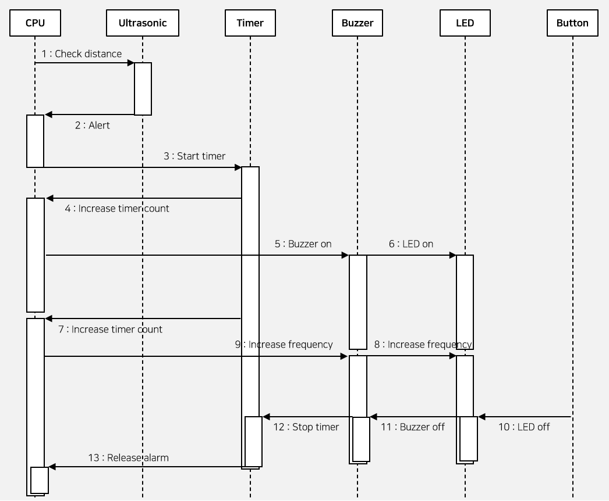
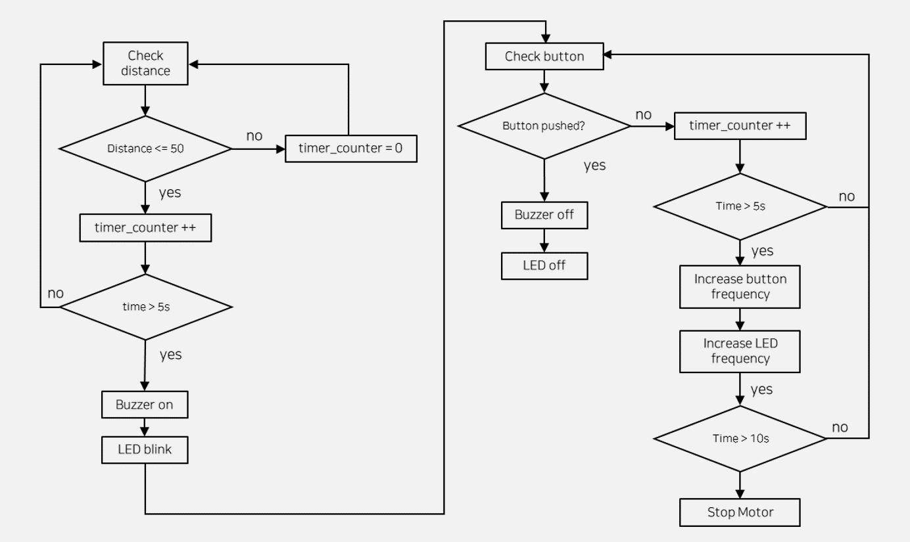

# Driver State Monitoring System with _Embedded Programming_

## HMC SWIP Team 3

|SeyoungKim|KeonwooJang|JungwooHan|HunHwangbo|HunkiLee|
|:-:|:-:|:-:|:-:|:-:|
||||||

## Hardware Specification
- ShieldBuddy TC275
- Arduino Motor Shield
- Yurobot Module Shield V1

## Proposed System
### Functional Specification
1. Our system employs an ultrasonic sensor with a low-pass filter to accurately detect driver drowsiness, ensuring reliable responsiveness even in noisy driving environments.
2. Once drowsiness is detected, a gradually increasing duration of buzzer alarm will alert the driver.
3. When the driver presses the switch, the buzzer alarm will cease, and the system will resume monitoring the driver's state.
4. If the driver fails to press the switch within a predetermined timeframe, the driving motor will be deactivated, and the emergency lights will activate, ensuring the driver's safety.

### Architecture
- This system utilized switches and a sonic sensor as sensors, while LEDs, buzzers, and a motor were used as actuators.
- To resolve a register overlap issue, the Sonic sensor was mounted on the YUROBOT board, and the motor was attached to the Arduino board. The two boards were then linked through GPIO pins to create an integrated system.
- The driver monitoring program runs on CPU0, and CPU1 has been assigned a watchdog that can continuously monitor the status of the program.

### Sequence Diagram

### Flow Chart

## Issues
### Refined Implementation Versions
To increase the chances of success, rather than setting only one challenging project goal, we have broken down the implementation into three versions starting with easier goals and progressing to more ambitious ones. Each version is characterized by an increasing number of sensors and actuators as the version number increases.

### Multi-Interrupt Handling through ERS Separation
To prevent conflicts between the ERS of the ultrasonic sensor and the switch sensor, we assigned a unique ERS to each sensor. Following the Infineon documentation, we allocated ERS2 to the switch sensor and ERS3 to the ultrasonic sensor, allowing us to simultaneously operate multiple interrupts without any interference.

### Multi-Time Measurement
To measure distance using the ultrasonic sensor, time measurement is required. However, we also need to measure the time of the entire alarm system. To accomplish independent time measurement, we utilized T12's CCU60 and CCU61, and even T13.

### Multi-Board Integration via GPIO Pin Communication
With the increase in implementation version, the number of actuators used has also increased. However, interference between the motor direction control register and the buzzer output register occurred due to their overlapping functions. To resolve this issue, we allocated the actuators to different boards and integrated them through communication via GPIO pins.
